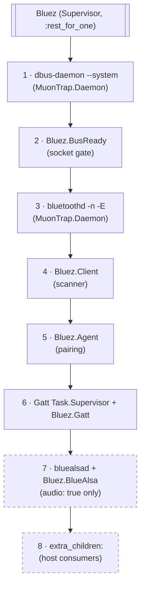
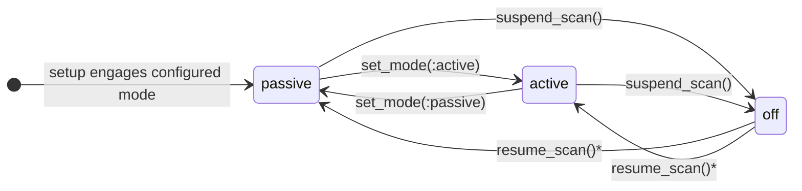
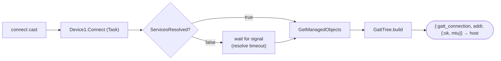

# Architecture

Bluez brings up the Linux BlueZ stack under one Elixir supervisor and
puts a set of `rebus` (pure-Elixir D-Bus) clients on top of it. Your
application plugs in through injected funs and child specs — the library
never calls back into named modules of yours, so it carries no compile-time
dependency on the host.

## Supervision tree

`Bluez` is a `:rest_for_one` supervisor. Order is load-bearing — each
child depends on everything above it, and a restart at level *N* rebuilds
levels *N+1..end* while leaving *1..N-1* untouched:

1. **`dbus-daemon --system`** (`MuonTrap.Daemon`) — owns the system bus.
   This library expects to *own* the bus: don't run it next to a distro
   dbus.
2. **`Bluez.BusReady`** — a gate that blocks in `init/1` until the bus
   socket exists, so `bluetoothd` never races the bus. It stays alive
   afterwards so a `dbus-daemon` restart re-runs the gate (and everything
   below it).
3. **`bluetoothd -n -E`** (`MuonTrap.Daemon`) — claims `org.bluez` and
   drives the adapter through the kernel mgmt socket. `-E` (experimental)
   is required for `AdvertisementMonitorManager1` passive scanning and
   the GATT `MTU` characteristic property.
4. **`Bluez.Client`** — the passive/active scanner (see below).
5. **`Bluez.Agent`** — the default NoInputNoOutput pairing agent. Before
   `Bluez.Gatt` because Gatt depends on it (weakly — its casts no-op when
   the Agent is down), never the other way around.
6. **`Bluez.Gatt`'s `Task.Supervisor` + `Bluez.Gatt`** — active
   connections and the GATT client.
7. **`bluealsad` + `Bluez.BlueAlsa`** — only with `audio: true` (the
   default). Placed *after* the scanning/GATT clients so an audio-daemon
   fault never restarts the scanning stack; the children that follow it
   do restart with it, which is intended — they're the same audio path.
8. **`extra_children:`** — host-supplied child specs, appended last.
   They restart with the audio path; a fault there never disturbs
   anything above. Ordering within the slot is the caller's contract.

The supervisor carries an explicit `max_restarts: 10, max_seconds: 60`
budget, sized so the *benign* failure loops (see below) never escalate
while a genuinely hot crash loop still reaches the host's supervisor
within a minute.

## Two rebus connections, two failure domains

`Bluez.Client` and `Bluez.Gatt` each own a private `rebus` connection.
Concurrent method calls on one connection don't serialize (replies are
correlated by serial), but every call still blocks its *calling*
process — so both GenServers push every BlueZ call into a `Task`
(`Device1.Connect` alone can take ~25 s), and keeping the connections
separate means a malformed frame or wedged call in the GATT domain can
never take the advert pipeline down with it. Each process monitors its
connection and stops when it dies; `:rest_for_one` rebuilds it with a
fresh connection.

## Scanning (`Bluez.Client`)

Two runtime-switchable modes, matching what ESPHome-style hosts expose:

- **`:passive`** (default) — registers an `AdvertisementMonitor1` object
  *we export* on the bus (the client is also a D-Bus service; this is
  what requires the rebus fork). BlueZ never sends scan requests, so
  peripherals don't burn battery answering us. The monitor's
  `or_patterns` match the common Flags values — the documented
  "match all devices" recipe.
- **`:active`** — `SetDiscoveryFilter` (LE, no duplicates) +
  `StartDiscovery`. Collects SCAN_RSP data (device names), at the cost
  of radio traffic.

*`resume_scan/0` re-engages whatever mode the host last configured —
suspension never overwrites it.

Mode transitions run in a `Task` (BlueZ calls back into our exported
objects *before* `RegisterMonitor` returns, so the GenServer must stay
free), are serialized with a one-slot pending queue (latest target
wins), engage the new mode before disengaging the old one (both can
legally coexist — a failed engage leaves the previous mode scanning
rather than going dark), and are watchdogged: a transition stuck past
its budget stops the Client for a fresh connection. The configured mode
persists in `:persistent_term` so a crash-restart re-engages what the
host last chose.

Device data arrives the same way in both modes
(`InterfacesAdded`/`PropertiesChanged` on `Device1` objects), so
everything downstream is mode-agnostic.

## Advert reconstruction

D-Bus does not expose raw over-the-air advertising bytes — only parsed
properties (`ManufacturerData`, `ServiceData`, `ServiceUUIDs`, `Name`,
`TxPower`, `RSSI`). `Bluez.Variant` unwraps the wire shapes,
`Bluez.Advert` re-serializes them into an AD byte structure (lossy:
element order and Flags are not recoverable, but faithful for the
manufacturer/service-data elements consumers key on), and
`Bluez.DeviceCache` emit-gates the stream: forward on first sighting,
on payload change, or on a heartbeat interval (RSSI freshness), with an
LRU cap so MAC-randomizing devices can't grow the cache without bound.
Whatever survives the gate is handed to your `on_advertisement:` fun.

## GATT (`Bluez.Gatt`)

Connection lifecycle:

The success event is deferred until BlueZ resolves services because
every subsequent request is *handle*-keyed, and the handle ↔ object-path
map (`Bluez.GattTree`) only exists once the GATT objects are visible.
Handles follow the bleak convention (characteristics report the value
handle, declaration + 1), so they line up with the GATT databases HA
caches from its other BlueZ/ESP32 sources.

Every entry is stamped with a monotonically increasing generation;
results from Tasks whose generation no longer matches the live entry are
stale and dropped, so a replaced or torn-down connection can never be
corrupted by a late reply. Pair/remove results carry the subscriber pid
in the Task message itself because BlueZ can drop the link (and the
entry, via the signal path) *before* the method returns —
hardware-observed; the op reply must not depend on the entry existing.

See the [host integration guide](host_integration.md) for the full
event contract.

## Pairing (`Bluez.Agent`)

The default `org.bluez` agent (NoInputNoOutput). `Bluez.Gatt`'s pair
Task brackets `Device1.Pair()` with `expect_pairing/1`/`pairing_done/1`,
so the agent authorizes exactly the pairings this stack initiated —
everything else is rejected. The expectation is TTL-backed: a Task that
dies before clearing it can't leave a device authorized forever.

## Audio (`Bluez.BlueAlsa`)

`bluealsad -p a2dp-source` exposes, for every connected A2DP sink, an
ALSA PCM (`bluealsa:DEV=MAC,PROFILE=a2dp`) that your audio pipeline can
open directly. `Bluez.BlueAlsa` is a bus client (not a bluealsad client
— it tolerates the daemon being down) that enumerates ready-to-open
playback PCMs via the v4 `ObjectManager` API and broadcasts
`{:bluealsa_pcms_changed}` on your PubSub when the set changes.

## Adapter selection

The kernel exposes no Bluetooth MAC in sysfs, so MAC → `hciX` resolution
can only happen once `bluetoothd` answers. The contract has two halves:

1. The host publishes the desired radio MAC (or `nil` = auto) under
   `Bluez.DevicePath.desired_adapter_key/0` **before** the supervisor
   (re)starts — either directly (a host that switches radios at runtime
   republishes before each restart) or via the `desired_adapter:` opt,
   which writes the term before the children start.
2. `Bluez.Client` matches that MAC against `bluetoothd`'s `Adapter1`
   objects during setup and publishes the resolved object path
   (`adapter_path_key/0`), falling back to the lowest-index adapter when
   the MAC is absent. A crash-restart re-resolves against the same term.

Known caveat: the setup retry loop waits for *any* adapter, not the
desired one — if the desired radio enumerates late (observed with
UART-attached radios racing rootfs mount on a Raspberry Pi 3), the
Client falls back until the host restarts the subtree.

## Benign failure loops

On a board with no working controller (no onboard radio, no USB dongle
yet), `Bluez.Client` gives up after its setup retries (`{:stop,
:no_adapter}`) and the subtree restarts, ~every 10 s. That loop is
*benign by configuration*: it fits inside the restart budget forever,
the app stays healthy, and a dongle hot-plugged later is picked up by
the next cycle. Same for `:dbus_connect_failed` while the bus is coming
up.

## Read-only rootfs (Nerves)

`bluetoothd` persists adapter identity and link keys under
`/var/lib/bluetooth`; on a read-only rootfs, point that at
`/data/bluetooth` with an overlay symlink (see the
[Nerves system guide](nerves_system.md) for the full system
customization list). `Bluez.prepare_runtime/0`
(called from `init/1`) creates `/run/dbus` + `/data/bluetooth`, removes
a stale bus socket left by a previous incarnation (socket existence must
imply a listener — hardware-found), and writes a machine-id.

## The `catch :exit` idiom

The synchronous read APIs (`Bluez.Client.adapters_info/0`,
`Bluez.BlueAlsa.pcms/0`, `Bluez.Gatt.connections_free/0`) are designed
for hosts to wrap in `catch :exit` so callers degrade gracefully while
the stack is down. Know what that swallows: both the not-running exit
AND a call timeout collapse into the same "subsystem off" default, so a
wedged server renders as a disabled subsystem rather than raising. Catch
only `:exit, {:timeout, _}` separately where that distinction matters.
